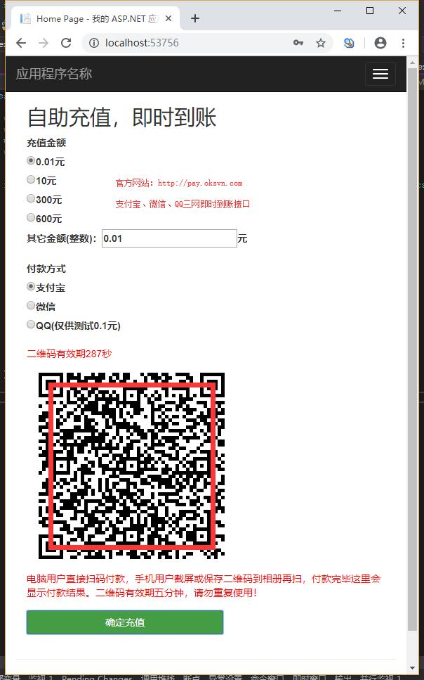
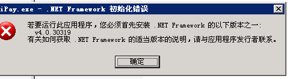
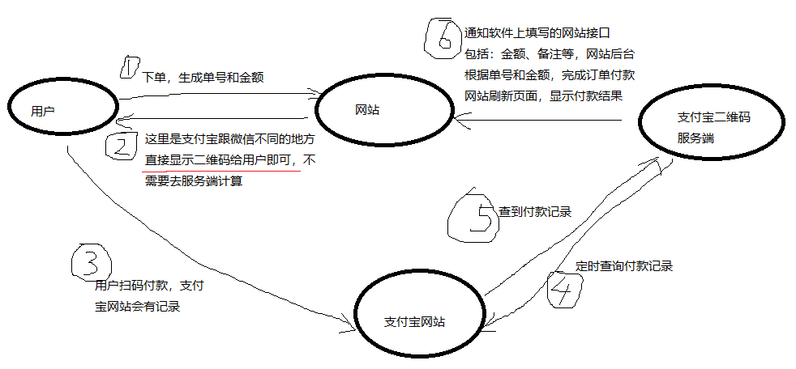
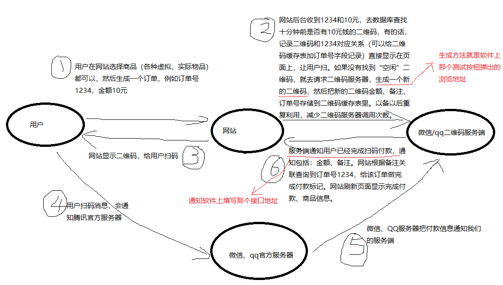

# 三网（支付宝、微信、QQ）即时到账接口使用和开发文档

## 声明
本接口禁止用于黄、赌、毒、外挂、投资理财、套现等违法、违规用途。如有发现取消授权，不通知、不退款，保留证据以备公安机关查阅。

## 概述
我们不是支付平台，也不提供资金托管和结算，我们只是一个辅助软件！
互联网和电子商务的飞速发展，产生了大量的收付款需求。官方支付平台门槛高、手续费高，我们的软件就是为了解决商家自动收款的痛点。使用我们软件可以实现自动收款、自动充值、自动发货。适应性广，任何网站、APP、软件都可以对接三网即时到账接口。

## 功能
三网（支付宝、微信、QQ）全自动即时到账接口，收款、充值、发货等
- 根据金额、备注自动生成收款二维码。
- 收到用户扫码付款后回调通知网站、软件。


## 运行环境
软件需要24小时不中断运行，这样才能保证24小时收款、通知。

最低配置：
- Windows XP以上个人电脑、云服务器、挂机宝
- 安装.net framework 4或以上。Windows2008以上系统自带该框架。

推荐配置：
- Windows2008 r2云服务器，够用的同时占用资源少。
- [腾讯云10元服务器，建议买1年，以免以后涨价](https://cloud.tencent.com/redirect.php?redirect=10004&cps_key=e4d6a0f86f6808af8f83b64a1c7acfe7)

如果您是Linux服务器，没关系。买一个Windows服务器也很便宜，有一个月几块钱的挂机宝。还是推荐大品牌的腾讯云、阿里云服务器。更靠谱！
## 软件使用
下载监控端：[支付宝、微信、QQ二维码即时到账服务端](http://pay.oksvn.com)
首先准备上述运行环境。从官方网站下载软件（试用和付费都是同一个），解压到电脑根目录，分别运行3个exe文件即可。


如果出现上图提示，请下载安装：[.net framework4](http://download.microsoft.com/download/9/5/A/95A9616B-7A37-4AF6-BC36-D6EA96C8DAAE/dotNetFx40_Full_x86_x64.exe)

## 软件登录
微信登录需要填写微信账号、密码。QQ也是填写QQ号和密码。支付宝的支持扫码和账号两种方式。

### 支付宝登录
生成二维码需要使用支付宝商户账号，商户账号是免费申请的。参考：[https://jingyan.baidu.com/article/c275f6ba05a96fe33d7567d9.html](https://jingyan.baidu.com/article/c275f6ba05a96fe33d7567d9.html)
然后扫码登录，能看到uid以后，用另外一个支付宝扫码付款给你，看软件日志是否显示订单即可。
### 微信登录
填写微信账号、密码，点击登录。首次使用需要验证设备（浏览器显示加载中时，关掉浏览器重新点击登录），通过验证以后再登录无需验证。
登录成功，能看到昵称后，用另外一个微信扫码付款给你，看软件日志是否显示订单即可。
软件设置“获取订单号”，则无需关注收款助手。软件会去服务器查询订单号。
如果不设置“获取订单号”，则需要关注“收款助手”，用于接收订单消息。相对来说不获取订单号更加节省资源，效率更高！
### QQ登录
填写QQ号、密码，点击登录。首次使用可能需要输入验证码、需要关闭各种登录验证、二维码登录等。
登录成功，能看到昵称后，用另外一个QQ扫码付款给你，看软件日志是否显示订单即可。

## 软件设置
接口需要技术人员设置，一般用户无法对接。官方提供对接技术支持、协助。

监听端口，是软件提供外部调用生成二维码的接口。监听端口可修改，但不要与系统或其它软件端口冲突。如有冲突更换端口号，重启软件即可。

## 技术对接文档
### 工作流程图




软件工作原理概述为2句话：
1. 根据金额（收多少钱）和备注（干什么）生成一个二维码，给用户扫。
2. 用户扫码付款后，软件会回调（通知）软件上填写的接口地址。（用户付款了，给他充值、发货等）

补充说明：
生成二维码时，支付宝是直接拼接二维码内容。微信和QQ需要调用挂机服务器的ip才能生成。因此这里就存在2个服务器：网站服务器、挂机服务器。生成二维码需要在网站上调用挂机服务器。
反之付款通知时，是挂机服务器调用网站服务器。这个调用地址就是在软件上填写的“接口地址”。
如果挂机服务器和网站服务器是同一个服务器，则同样适用上述规则。只不过两个地址都是同一个服务器。以上两条路线不要搞混淆。

### 支付宝生成二维码
以uid为1111，金额10元，备注1234为例：

- uid就是软件上面登录支付宝后日志里显示的uid。软件授权也是绑定uid的，uid与支付宝账号关联。
- amount，金额单位元，用户扫码时可以看到，不可修改。
- desc，卖家备注，用户扫码时可以看到自动填写好的备注信息，不可修改，通常存储订单号。

```
http://pay.oksvn.com/alipayqr.aspx?uid=1111&amount=10&desc=1234
```

上面内容生成二维码给用户扫即可。后台生成二维码图片，或者前台JS生成二维码都可以。或者到[https://cli.im/text](https://cli.im/text)测试二维码。

此二维码可无限量生成、无时效。以上接口仅供授权用户使用。

### 支付宝回调接口
测试接口代码，测试代码非常简单，就是收到什么就返回什么：
```
<?php
print_r($_POST);
?>
```

点击“测试接口”，弹出文件选择“支付宝测试接口用模拟订单.txt”，观察日志：
```
发送订单：key=123&tradeNo=2019030122001481521021111112&goodsTitle=&transMemo=%e8%8a%b1%e5%91%97%e4%ba%a4%e6%98%93%e5%8f%b7%5b2019030122001481521021111111%5d&tradeTime=2019-01-01+12%3a17%3a52&username=*%e5%8b%87&userid=z11***%40qq.com&amount=12.00&uid=2088902565828418
★2019/5/24 10:13:53 订单推送结果：Array
(
    [key] => 123
    [tradeNo] => 2019030122001481521021111112
    [goodsTitle] => 
    [transMemo] => 花呗交易号[2019030122001481521021111111]
    [tradeTime] => 2019-01-01 12:17:52
    [username] => *勇
    [userid] => z11***@qq.com
    [amount] => 12.00
    [uid] => 2088902565828418
)
```
说明接口收到订单后，回调采用http post协议提交，提交参数解释：
- key，接口秘钥，防止恶意调用回调地址，需要在回调地址里对比key与软件填写是否一致
- tradeNo，支付宝交易号，我们一般用这个编号排除重复订单。**而且必须排除重复订单！因为每次软件启动都会重复推送最近订单！！**
- goodsTitle，备注。备注分两种，卖家备注和买家备注，上文生成二维码时自动填写的desc就是卖家备注。卖家备注和卖家备注共用该字段，因此生成二维码时填写了备注，这里就是卖家备注。
- transMemo，没啥用，不用管
- tradeTime，没啥用，不用管
- username，没啥用，不用管
- userid，没啥用，不用管
- amount，金额，单位元。
- uid，收款账号的uid，如果你有多个账号收款，可以用于区分。

上面参数看来，通常只需处理key、tradeNo、goodsTitle、amount、uid这5个参数即可。收到回调，根据这5个参数做充值、发货处理即可。
### 返回标志
回调返回内容如果包含“返回标志”，则表示接口接收订单成功，不再重复推送订单。否则会重复推送，直到收到“返回标志”为止。返回标志在软件界面上填写。例如填写“#”，则返回“#成功”“#失败”，都表示接口已经接收，不再重复推送。

**再次强调：必须排除重复订单，否则可能给您造成经济损失！**

如果重启服务器或者支付宝掉线，重新登录即可发送不在线期间发生的订单。不建议长时间不在线。

收款后的金额去向问题，可直接在手机上提现。

### 微信生成二维码
```
http://localhost:8080/?amount=4&desc=8557&key=123456
```
生成二维码接口说明：

- localhost，服务器名称，也可以用服务器ip替换，例如：127.0.0.1或者公网ip，请注意防火墙上开放端口8080
- 8080，默认的监听端口。本软件自带web服务，启动软件，点击“测试接口”按钮，就可以测试生成二维码功能。
- amount，金额，**单位分**，用户扫码时可以看到，不可修改
- desc，生成的二维码备注，这是卖家备注，用户扫码时可以看到，不可修改
- key，与软件填写的秘钥一致，防止恶意调用。

PHP调用示例：
```
<?php
print_r(file_get_contents('http://localhost:8080/?amount=4&desc=8557&key=123456'));
?>
```

返回示例：
```
wxp://f2f1w2FV5UUuZd3DK4w13KHwi6lI4OgaXaDd
```
这就是一个文本形式收款二维码了，把它转成二维码图片给用户扫码就行了。

### 微信二维码缓存
微信服务器对二维码生成有频率限制，因此请务必做二维码缓存。使用二维码缓存策略，正常情况下即使高并发付款也是100%安全可靠的。

二维码缓存办法：每次调用生成二维码，都记录二维码信息。一个办法是：建立二维码缓存表，每次需要二维码时去检查是否有“**10分钟前生成的**”或者“**订单号为0**”的同等金额的二维码，如果有，二维码字段写入：订单号、时间，表示该二维码被占用。如果没有找到二维码，去生成一个新的，再写入订单号、时间、二维码内容、金额、备注。
```
CREATE TABLE [QRCache](
	[Id] [int] IDENTITY(1,1) NOT NULL,
	[Amount] [decimal](18, 2) NOT NULL,
	[Content] [nvarchar](max) NULL,
	[OrderId] [bigint] NOT NULL,
	[LockTime] [datetime] NOT NULL
)
```

### 微信回调接口
测试接口代码，测试代码非常简单，就是收到什么就返回什么：
```
<?php
print_r($_POST);
?>
```
用户扫码付款后一个日志类似：
```
收到二维码付款：4 8557  2019/5/24 10:41:11 
2019/5/24 10:41:09 发送订单：key=123456&amount=4&memo=8557&payermemo=&time=2019%2f5%2f24+10%3a41%3a11&Outtradeno=10000499012019052800002186948239&WxUserName=xinxinbot 
2019/5/24 10:41:09 收到返回：Array
(
    [key] => 123456
    [amount] => 4
    [memo] => 8557
    [payermemo] => 
    [time] => 2019/5/24 10:41:11
    [Outtradeno] => 10000499012019052800002186948239
    [WxUserName] => xinxinbot
) 
```
参数说明：
- key，秘钥，防止恶意回调
- amount，金额，**单位分**，这个是生成二维码时定好的，用户扫码直接付款，不可修改。
- memo，卖家备注，生成二维码时传递过去，定好的。用户扫码可以看到，不可修改。
- payermemo，买家备注，可以根据这个做一些其它功能，比如留言账号充值。
- time，付款时间
- Outtradeno，微信转账单号
- WxUserName，登录的微信账号。多收款账号时可用于区分。也可以用于账目统计、对账。

如果付款后，软件没有出现上面订单信息，有可能是微信没有关注收款助手。手机登录微信关注一下，再登录微信收款软件重新测试。

排除重复订单问题，由于微信通知是即时推送，因此无需排除重复订单。如有发现重复订单，请手机上登录微信，看是否关注了多种收款类公众号。

如果重启服务器或者微信掉线，重新登录即可发送不在线期间发生的订单。不建议长时间不在线。

收款后的金额去向问题，一个办法是关闭软件，手机上提现。另一个办法是提前发放亲属卡，直接在其它微信上消费。

### QQ生成二维码
生成二维码接口
```
http://localhost:8081/?amount=8&desc=3703&key=123456
```
生成二维码接口说明：

- localhost，服务器名称，也可以用服务器ip替换，例如：127.0.0.1或者公网ip，请注意防火墙上开放端口8081
- 8081，默认的监听端口。本软件自带web服务，启动软件，点击“测试接口”按钮，就可以测试生成二维码功能。
- amount，金额，**单位分**，用户扫码时可以看到，不可修改
- desc，生成的二维码备注，这是卖家备注，用户扫码时可以看到，不可修改
- key，与软件填写的秘钥一致，防止恶意调用。

PHP调用示例：
```
<?php
print_r(file_get_contents('http://localhost:8081/?amount=8&desc=3703&key=123456'));
?>
```

返回示例：
```
https://i.qianbao.qq.com/wallet/sqrcode.htm?m=tenpay&f=wallet&a=1&ac=BE7F6A40B177C455F804D1D3779985F71AC1FA7D439779F351DFC37B3CF879F22F68495D692F57BCFCA8AA561DC8A1C9CDCA39DE0F3B1FFD&u=976811781&n=%e7%8e%b0%e5%9c%a8
```
这就是一个文本形式收款二维码了，把它转成二维码图片给用户扫码就行了。

### QQ回调接口
测试接口代码，测试代码非常简单，就是收到什么就返回什么：
```
<?php
print_r($_POST);
?>
```
用户扫码付款后一个日志类似：
```
2019/5/24 11:29:29 发送订单：key=123456&listid=101000026901501905241446492187&amount=8&memo=3703&payer_uin=4111852&payer_name=%e5%b0%8f%e7%81%b0&qq=976811781 
2019/5/24 11:29:29 通知结果：Array
(
    [key] => 123456
    [listid] => 101000026901501905241446492187
    [amount] => 8
    [memo] => 3703
    [payer_uin] => 4111852
    [payer_name] => 小灰
    [qq] => 976811781
) 
```
参数说明：
- key，秘钥，防止恶意回调
- listid，订单号，我们一般用这个编号排除重复订单。**而且必须排除重复订单！因为每次软件启动都会重复推送最近订单！！**
- amount，金额，**单位分**，这个是生成二维码时定好的，用户扫码直接付款，不可修改。
- memo，卖家备注，生成二维码时传递过去，定好的。用户扫码可以看到，不可修改。
- payer_uin，买家QQ，不用管
- payer_name，买家昵称，不用管
- qq，登录的QQ账号。多收款账号时可用于区分。也可以用于账目统计、对账。

QQ收款为了服务更加稳定，是每分钟查询一次，因此订单通知没有微信和支付宝那么快，1分钟内通知。

**排除重复订单问题，必须排重！必须排重！必须排重！**

如果重启服务器或者QQ掉线，重新登录即可发送不在线期间发生的订单。不建议长时间不在线。

收款后的金额去向问题，可直接在手机上提现。

## 示例代码
好像没什么可写的，原理懂了，就2个问题：生成二维码，付款通知。以后再加吧！

## 接口征集
如果您有某个系统的对接本软件的接口，请联系我交换本软件。例如：discuz、pw等！